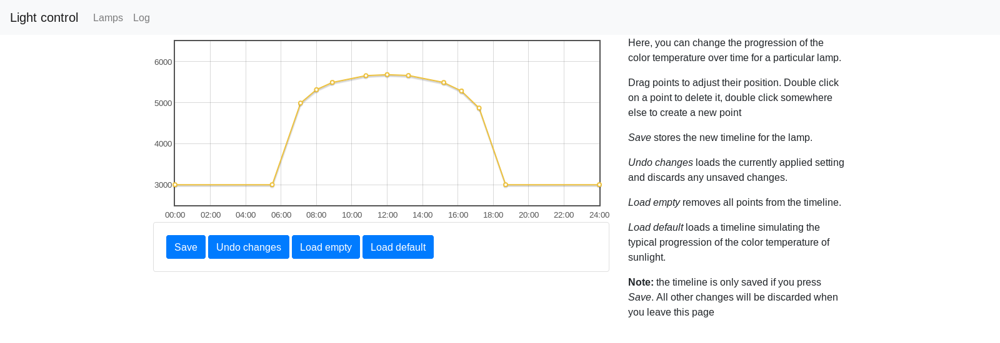

erlotter-sw
-----------

This is the firmware and control software for a software-defined
constant current (and flicker-free current-dimming) LED driver for
dual-color (warm and cold white) LED panels. The hardware is based on
the STM32F334 microcontroller, for more details about the hardware, see
[this](https://github.com/NiklasFauth/fixme) repo.

Each node controls one panel and all nodes can be remotely controlled
via a 50 kbps CAN bus. By default, the lamps synchronize the time over
the CAN network and display a color timeline which resembles the color
of daylight at a given location (see `misc/calc-color.scm` for the code
generating those timelines). Each lamp can also be configured for
another color profile individually from a central web frontend.

License
-------

The following code is included from external projects and is subject to
the respective license of that project:

* The [Bootstrap](https://getbootstrap.com/) project: Files in `mgmt/ui/css/bootstrap` and `mgmt/ui/js/bootstrap`
* The [Flot](http://www.flotcharts.org/) and [jQuery](https://jquery.com/) projects: Files in `mgmt/ui/js/flot`
* The [STM32Cube SDK](http://www.st.com/en/embedded-software/stm32cube-mcu-packages.html): Parts of the files in `firmware/stm`

All other code is (c) 2017 Florian Larysch and covered by the AGPL, see
`LICENSE`.
